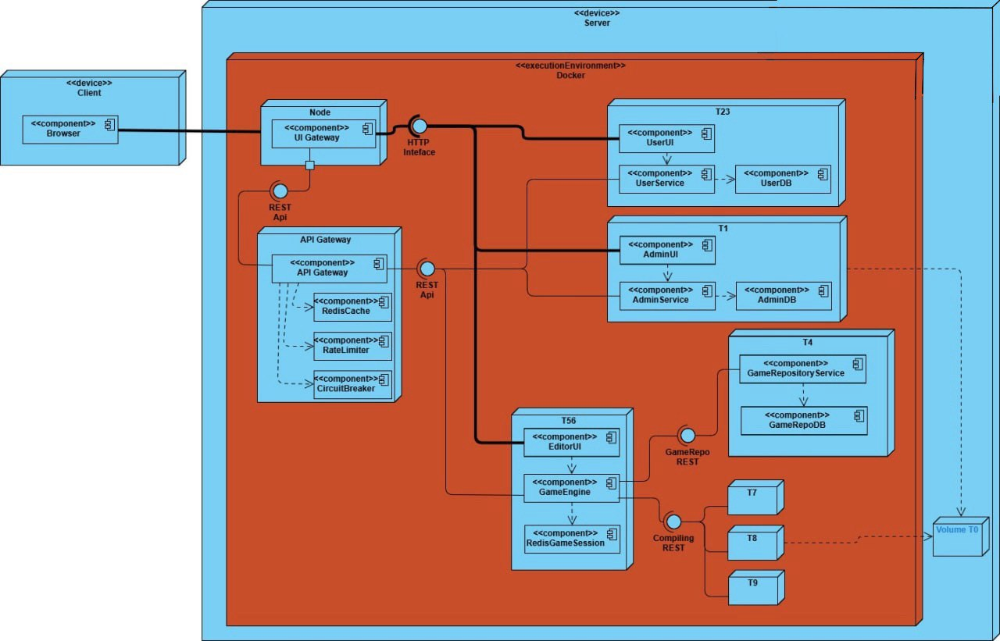

# Introduction

TestingRobotChallenge is a web application designed to support learning software testing through gamification, where
players compete against preconfigured opponents. Each player's goal is to write JUnit4 test code for a given Java class,
trying to surpass — or at least match — the score achieved by the selected opponent.

## Main Features

* **Role-based access**: Users can register as administrators or players. Administrators — typically teachers — can
  upload new Java classes to test and configure opponents (called robots). Players — usually students — can then
  challenge these robots;
* **Experience points and achievements**: Players earn experience points for each robot defeated, contributing to level
  progression. Specific challenges unlock achievements;
* **Match history**: A dedicated section allows players to review past matches, indicating which were won or lost;
* **Multiple game modes**: The platform currently supports two game modes:
    * **Training**: Players can practice freely on a Java class without competing against a robot and without earning
      points.
    * **Single match**: Players compete against a robot trying to match or exceed its bytecode instruction coverage
      score. Matches are timed, with duration chosen by the player before starting.

## Architecture and Implementation

The platform is implemented as a web application accessible from browsers, based on a microservices architecture. Each
component is containerized via Docker and exposes REST APIs, making the system easy to deploy, scale, and maintain.

The main microservices are:

1. **T1**, which manages administrator functionalities, including managing classes and robots;
2. **T23**, which handles user authentication (both administrators and players) and all related information;
3. **T4**, which tracks the state of matches;
4. **T5**, which manages game logic and related web interfaces;
5. **T7**, which compiles the provided test code and calculates coverage metrics using **JaCoCo**;
6. **T8**, which compiles the provided test code and calculates metrics based on **EvoSuite**.

The system is accompanied by two additional standalone services:

1. **T0**, an autonomous component able to automatically generate JUnit 4 tests for a given Java class using **Randoop**
   and **EvoSuite**;
2. **db-backup**, a utility service that regularly performs backups (as dumps) of the **PostgreSQL** and **MySQL**
   databases used by **T23** and **T4**.

A graphical overview of the architecture is shown in the image below.

## Data Persistence

The system uses Docker volumes and containerized databases for data persistence. In particular:

1. **T23** communicates with a **MySQL** database for user authentication and all associated data;
2. **T4** communicates with a **PostgreSQL** database to store match data;
3. **T1** communicates with a **MongoDB** database to manage file paths for the Java classes uploaded for testing and
   the related opponents;
4. The shared Docker volume **VolumeT0** is used to save a copy of each Java class to be tested along with its robots,
   as well as a copy of each player's compilation output including the corresponding metrics.

## Technologies Used

The following table summarizes the technologies used for the implementation of the various modules:

| Module      | Backend                | Frontend                 | Database   |
|-------------|------------------------|--------------------------|------------|
| T0          | Java and shell scripts | –                        | –          |
| T1          | Spring Boot (Java)     | Thymeleaf, HTML, CSS, JS | MongoDB    |
| T4          | Spring Boot (Java)     | –                        | PostgreSQL |
| T5          | Spring Boot (Java)     | Thymeleaf, HTML, CSS, JS | –          |
| T7          | Spring Boot (Java)     | –                        | –          |
| T8          | Spring Boot (Java)     | –                        | –          |
| T23         | Spring Boot (Java)     | Thymeleaf, HTML, CSS, JS | MySQL      |
| db-backup   | Shell scripts          | –                        | –          |
| Gateway API | Spring Cloud Gateway   | –                        | –          |
| UI Gateway  | NGINX                  | –                        | –          |
