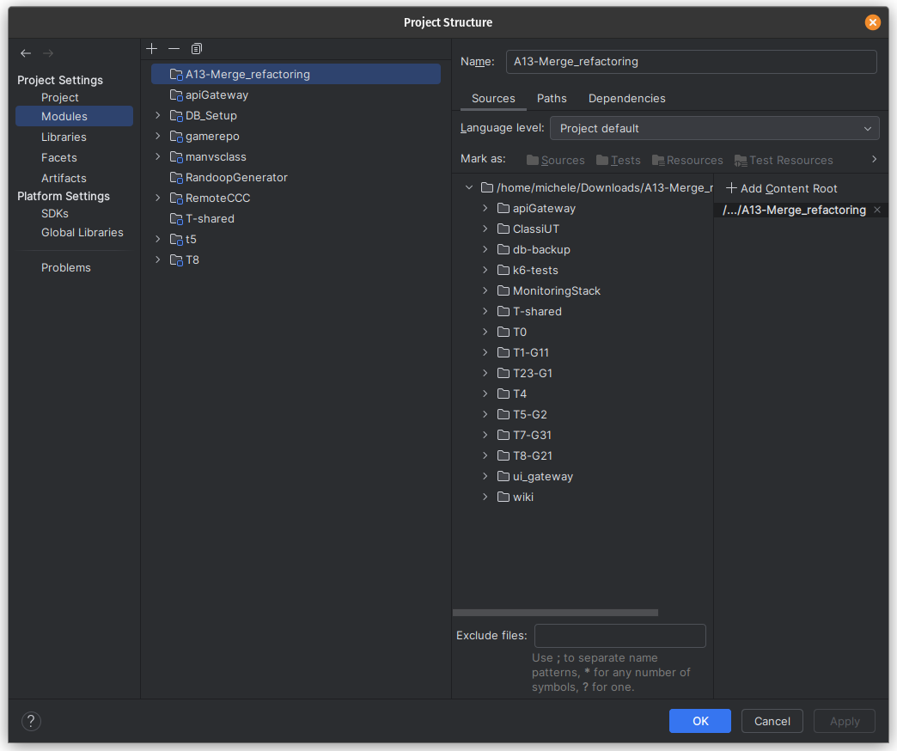
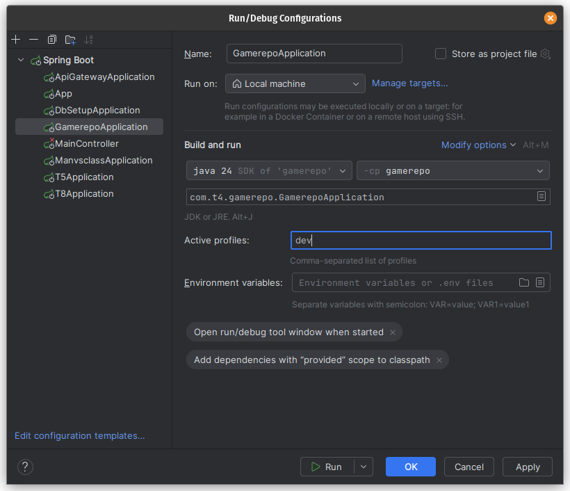
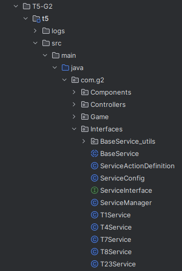

# Deployment and Execution

The tool can be executed either **locally** or using **Docker containers**.

## Docker

Each microservice is accompanied by:

1. A `Dockerfile`, which defines how to build the Docker image (base image, dependencies, copied files, startup
   commands, etc.);
2. A `docker-compose.yml` file, which allows defining and managing multiple Docker containers as a single application (
   e.g., for services that interact with databases).

While each image can be built and deployed individually from the command line, it is **strongly recommended** to use the
provided scripts located in the root directory of the project. This is because the system relies on specific **Docker
volumes and networks**. In particular:

- `build.bat` / `build.sh`: Build the Docker image for each microservice;
- `deploy.bat` / `deploy.sh`: Create the required Docker volumes and networks, then deploy and start all containers.
  Deployment supports two modes:
    1. If local images are available, containers will be built from those;
    2. If not, the latest version from Docker Hub will be pulled and used;
- `selective_build_and_deploy.bat` / `selective_build_and_deploy.sh`: Build, deploy, and start selected microservices.

We recommend using **Docker Desktop** to manage images, containers, and volumes.

## Local Execution

Running the application locally is only recommended for early development stages. A Docker-based run must follow to
ensure upgrade compatibility.

We suggest using **IntelliJ IDEA Ultimate Edition** for local development, due to its robust support for Spring Boot.
This guide is based on that IDE.

The setup involves four main steps:

1. Import the project and all its modules;
2. Deploy and start the required database and Redis containers;
3. Start NGINX locally;
4. Update the Spring modules’ run configurations.

### Project Import

Upon opening the project for the first time, IntelliJ should prompt you to load all project modules. If not, load them
manually as explained in
the [official IntelliJ documentation](https://www.jetbrains.com/help/idea/creating-and-managing-modules.html).

Once the modules are imported, you should see them listed as shown in the image below (accessible via
`File -> Project Structure -> Modules`).
Run configurations for the Spring modules should be generated automatically.

### Database Setup

For simplicity, the databases will be deployed using Docker:

* You need to **modify the `docker-compose.yml` files** of modules **T1**, **T23**, and **T4**: change the `expose`
  directive to `ports` for the `db` services to make the databases accessible from outside Docker.
* Do the same for the **T5** module to expose the `redis` cache service.
* Once modified, run the `build` and `deploy` scripts as explained above.
  Then, **stop all containers except** the database and Redis services.

### Installing and Running NGINX Locally

Local execution requires a **local NGINX installation**.
Once installed, copy the contents of the `ui_gateway` module into the appropriate NGINX directories, following the same
logic used in the module’s Dockerfile.

Attention: dDestination folders may vary depending on the operating system used* (e.g., `/etc/nginx/`,
`/usr/share/nginx/html/`).

### Updating Run Configurations

For modules **T1**, **T23**, and **T4**, open the run configurations created by IntelliJ and add `dev` as an **Active
Profile**, as shown below:

For module **T5**, you need to manually update the API Gateway URL.
Edit the `BASE_URL` constant in the following classes: `T1Service`, `T23Service`, `T4Service`, `T7Service`, and
`T8Service`.
The location of these classes is shown below:

