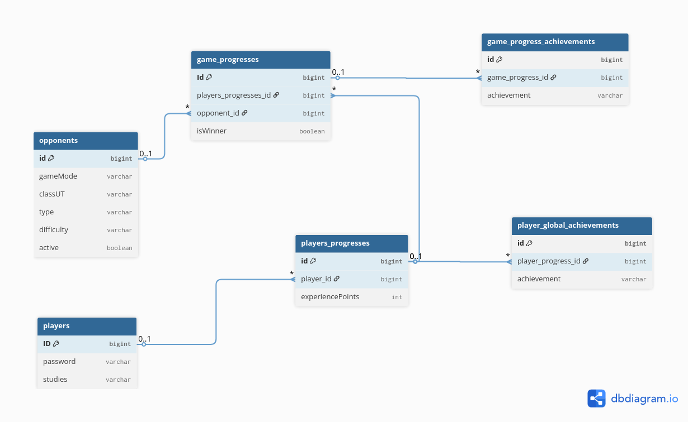

# T23 Module

The T23 module of the system is responsible for:

1. Registering and authenticating users such as players (e.g., students) and administrators (e.g., instructors);
2. Storing and managing all information associated with these two roles.

## Module Structure Overview

The module consists of a set of packages, as shown below:

```html
com.example.db_setup
├── controller/
│   ├── advice
│   └── view
├── filter/
├── interceptor/
├── language/
├── model/
│   ├── dto
│   └── repository
├── security/
│   ├── jwt
│   └── service
├── service/
│   └── exception
└── DbSetupApplication
```

In detail:

1. The package `controller` contains the REST controllers that expose the module’s endpoints.
   The subpackage `advice` includes global exception handlers, which translate service-layer exceptions into appropriate
   HTTP responses,
   while the subpackage `view` contains controllers for handling view-based requests;
2. The package `filter` contains a simple logging filter for the HTTP request received by the microservice;
3. The package `interceptor` contains the system’s interceptors and their related configurations;
4. The package `language` provides all classes necessary for handling language switching and localization.
5. The package `model` defines the core domain model of the module.
   The subpackage `dto` holds all Data Transfer Objects used for communication with the client,
   while the subpackage `repository` includes Spring Data JPA repositories for accessing and persisting entities in the
   database.
6. The package `security` includes all classes related to implementing the system’s security. The subpackage `jwt`
   provides utilities and classes for JWT handling,
   while the subpackage `service` contains services for authentication and authorization.
7. The package `service` contains the business logic of the module. Each service focuses on a specific area of
   functionality, such as user management or authentication.
   The subpackage `exception` defines all custom exceptions thrown by the service layer to indicate domain-specific
   errors.

## Authentication and JWT

User authentication (for both players and administrators) is managed via JSON Web Tokens (JWT), handled through cookies
on the frontend and through Spring Security on the backend.
This approach was chosen to avoid having to manually include the JWT in each request from the client, as the browser
automatically includes cookies with all HTTP requests.

The authentication and JWT handling is provided by the `security` package, which has the following structure:

```html
security
├── jwt
│   ├── AuthEntryPointJwt
│   ├── AuthTokenFilter
│   ├── JwtProvider
│   └── JwtValidationResult
├── service
│   ├── AdminDetailsServiceImpl
│   ├── PlayerDetailsServiceImpl
│   └── UserDetailsImpl
├── AuthenticationPropertiesConfig
└── WebSecurityConfig
```

The `WebSecurityConfig` class serves as the main Spring Security configuration for the system, while
`AuthenticationPropertiesConfig` defines the constants used during JWT creation (e.g., cookie name, TTL, etc.). These
constants are defined in the module's `application.properties` file.

### Subpackage `jwt`

The `jwt` subpackage contains all classes related to JWT management and processing.

| Class                 | Purpose                                                                                                                                                       |
|-----------------------|---------------------------------------------------------------------------------------------------------------------------------------------------------------|
| `AuthEntryPointJwt`   | Handles authentication error responses. It is automatically triggered when an unauthenticated request attempts to access a protected resource.                |
| `AuthTokenFilter`     | HTTP request filter that intercepts requests, extracts the JWT from cookies, and determines whether the user is authenticated by delegating to `JwtProvider`. |
| `JwtProvider`         | Provides utility methods to generate, validate, and extract data from JWTs.                                                                                   |
| `JwtValidationResult` | Defines the format of the response returned by `JwtProvider` when validating a JWT.                                                                           |

### Subpackage `service`

The `service` subpackage contains the Spring Security service classes for user authentication.

| Class                      | Purpose                                                                                                                                                                                                                                                            |
|----------------------------|--------------------------------------------------------------------------------------------------------------------------------------------------------------------------------------------------------------------------------------------------------------------|
| `UserDetailsImpl`          | Implements Spring's `UserDetails` interface and represents an authenticated user in the system. It acts as a bridge between the domain entities (Admin and Player) and Spring Security, allowing the authentication framework to handle both user types uniformly. |
| `PlayerDetailsServiceImpl` | Implements Spring's `UserDetailsService` interface and is responsible for retrieving a player from the database using their email.                                                                                                                                 |
| `AdminDetailsServiceImpl`  | The counterpart to `PlayerDetailsServiceImpl`, but for admin users.                                                                                                                                                                                                |

## Refresh Token

Along with the JWT (which has a limited duration), returned to a user upon login, a refresh token is also issued. This
allows modules to automatically request a new JWT without requiring the user to log in again manually.

The system is designed so that the JWT has a short lifespan, while the refresh token has a much longer one.

Unlike the JWT, the refresh token is stored in the*database and associated with the corresponding user. Each user can
have at most one associated refresh token. If a new token is generated, the previous one is revoked (but not deleted
from the database, for monitoring purposes).

The refresh token is sent and received via cookie, for the same advantages listed for the JWT. It is generated and
returned to the user upon login and revoked upon logout. The involved classes in the module structure are shown below:

```html
com.example.db_setup
├── model
│   ├── repository
│   │   └── RefreshTokenRepository
│   └── RefreshToken
└── service
    ├── exception
    │   └── InvalidRefreshTokenException
    └── RefreshTokenService
```

The service class `RefreshTokenService` handles refresh token management for authentication of both **Player** and *
*Admin** users in the system. An overview of the provided functionality is shown in the table below:

| **Method**                              | **Description**                                                                            |
|-----------------------------------------|--------------------------------------------------------------------------------------------|
| `generateRefreshToken(Player player)`   | Generates a new refresh token for a Player, revokes previous tokens, and returns a cookie. |
| `generateRefreshToken(Admin admin)`     | Generates a new refresh token for an Admin, revokes previous tokens, and returns a cookie. |
| `generateCleanRefreshToken()`           | Returns a cookie that removes the token on the frontend (useful for logout).               |
| `verifyToken(String refreshToken)`      | Verifies that the token is valid and not expired. If expired, it revokes it.               |
| `invalidAllUserRefreshTokens(Player p)` | Revokes all tokens associated with a specific Player.                                      |
| `invalidAllAdminRefreshTokens(Admin a)` | Revokes all tokens associated with a specific Admin.                                       |
| `rotate(RefreshToken oldRefreshToken)`  | Revokes a single token (sets `revoked = true`).                                            |

## Interceptors

```html
interceptor
├── AuthenticatedUserInterceptor
└── InterceptorConfig
```

The `interceptors` package currently provides a single interceptor: `AuthenticatedUserInterceptor`.
Its role is to intercept navigation requests from users who are already authenticated and redirect them to their
respective main pages.

The currently intercepted paths include:

1. `/login`, `/register`, `/change_password`, and `/reset_password` for players;
2. `/admin/login`, `/admin/register`, `/admin/change_password`, and `/admin/reset_password` for administrators.

## Player Progession

The **T23** module is responsible for persisting player progress, maintaining information such as unlocked achievements,
earned experience points, and defeated opponents. The associated ER schema is shown below.



Upon successful registration of a new player, their game progress is automatically initialized in the
`players_progresses` table.
This table tracks the earned experience points, the global achievements unlocked (stored in the
`player_global_achievements` table,
defined as an `@ElementCollection` of `PlayerProgress`), and the opponents faced (tracked through the `game_progresses`
table).

Each `GameProgress` entry records whether the player defeated the opponent and which achievements were unlocked during
that game (stored in the `game_progress_achievements` table, defined as an `@ElementCollection` of `GameProgress`).


