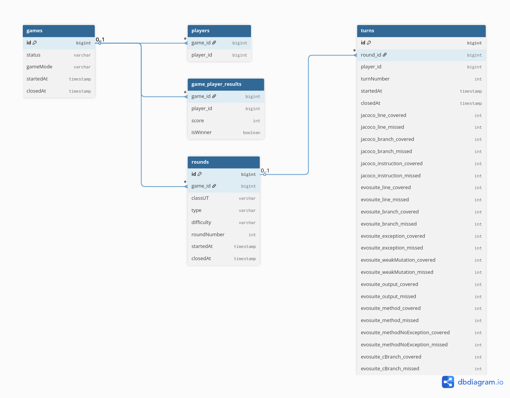

# T4 Module - Game Repository

The T4 service is responsible for managing the persistence of both ongoing and completed games, communicating with a
PostgreSQL database to store and retrieve game-related data.

This service is implemented using Spring Boot and runs on Java 17.

## Architecture

The module adopts a layered architecture, as is typical in classic Spring Boot REST projects.

```html
[ Client ]
⇕
[ Controller ] → [ Exception Handler ]
⇕
[ Mapper to/from DTO ] // where needed
⇕
[ Service ]
⇕
[ Repository ↔ Entity ]
⇕
[ Database ]

```

### Package Structure

Following the architecture, the project is organized as following:

```
com.t4.gamerepo
├── controller
│   └── advices
├── mapper
├── model
│   ├── dto
│   ├── repositories
├── service
│   └── exceptions
└── GamerepoApplication.java
```

In details:

1. `controller`: contains the REST controllers that expose the module's endpoints. The subpackage `advices` includes
   global exception handlers, for translating service-layer exceptions into appropriate HTTP responses).
2. `mapper`. includes mapper classes responsible for transforming between DTOs and domain entities.
3. `model`: contains the core domain model of the module. The subpackage `dto` holds all the Data Transfer Objects used
   for client interaction, while `repositories` includes Spring Data JPA repositories used for accessing and persisting
   entities in the database.
4. `service`: contains the business logic of the module. Each service encapsulates a specific area of functionality,
   such as managing games, rounds, or player turns. The subpackage `exceptions` defines all the custom exceptions thrown
   by the service layer to signal domain-specific errors (e.g., invalid game state, missing round, etc.).

## Data model and Rest endpoints

Games are managed using the following main entities:

- **Game**: describes an ongoing or completed game for a specific player;
- **Round**: represents a round within a game;
- **Turn**: represents a turn within a round.

The available REST endpoints are documented in the accompanying OpenAPI specification referenced in this README.



A **Game** entity is created when a new match begins. It includes:

1. The selected game mode;
2. One or more players associated with the match, allowing support for both single-player and multiplayer modes;
3. The final results for each player, including their scores and whether they won the game;
4. The current status of the game (e.g., created, in progress, etc.).

A Game can consist of one or more **Rounds**. Each **Round** specifies:

1. The class under test selected for the round;
2. The opponent type chosen among those available for that class;
3. The difficulty level of the chosen opponent;
4. A sequential number starting from 1, representing the unique index of the round within the associated game.

The class, opponent type, and difficulty are stored within each round to support game modes where the opponent may vary
between rounds.

A Game can consist of one or more **Turns**. Each **Turn** records:

1. The ID of the player who took the turn;
2. The result achieved by the player, in terms of both JaCoCo and EvoSuite metrics;
3. A sequential number starting from 1, representing the unique index of the turn within the associated round.
