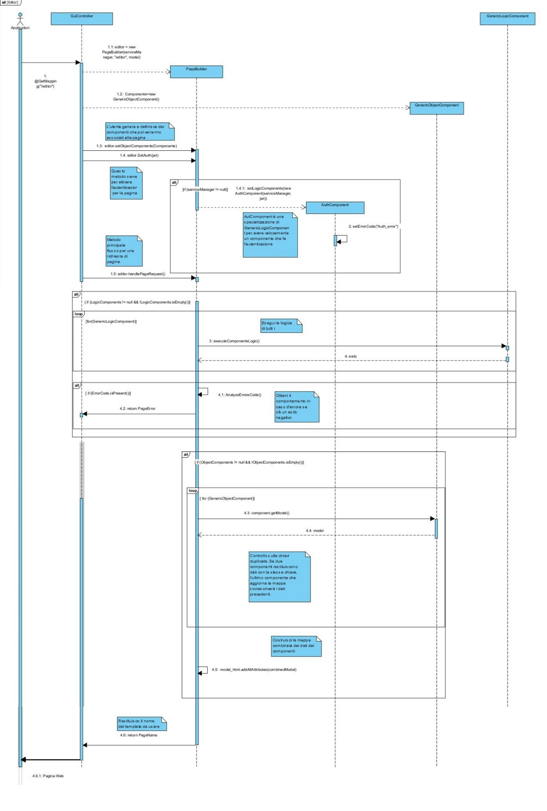

# T56 - Component Package

The **Component package** manages and organizes the various components of web pages.
Its primary goal is to separate business logic from data and the user interface, enabling a more modular and
maintainable
application architecture.

## Structure and Role

Each component within the Component package represents a part of a page, with well-defined and easily extendable
responsibilities.
The logic of each component is separated from view rendering, allowing effective integration with the templating system
(e.g., Thymeleaf).

The **PageBuilder** is the main tool, designed to simplify the creation and management of web pages in a Java Spring
application.
It acts as a bridge between user interface components and backend services, enabling dynamic and modular page
construction.
Thanks to its flexible architecture, PageBuilder allows developers to efficiently design interactive and responsive user
experience.

## Main Features

* **Dynamic Page Structure:** PageBuilder allows assembling web pages dynamically, adding components based on the
  specific context of the page.
* **Component Integration:** Supports integration of various components for both data presentation and business logic,
  simplifying code organization.
* **Thymeleaf Integration:** Leverages the Thymeleaf template engine to efficiently generate HTML, ensuring pages are
  optimized for interaction with service data.
* **Prerequisite Management:** Allows defining prerequisites for pages, ensuring all conditions are met before content
  is loaded, improving user experience.

The main goal of PageBuilder is to provide a robust and scalable framework for building web pages, reducing development
time a
nd increasing component reusability. Its ability to dynamically manage content and services enhances both efficiency and
quality in web applications.

## Class Diagram: Components


### Components

1. **PageBuilder:** Central to dynamic page construction. Combines **logic components** and **object components** (
   business logic and data) for high flexibility and modularity.
   Manages and renders pages, orchestrating component execution and handling errors during the process.

2. **GenericObjectComponent:** Base class for managing objects used in the page model.
   Inserts data into the model using a map (`Model`) containing objects associated with specific keys, which are then
   passed to templates for rendering.
   Can be extended by specific object components like **ServiceObjectComponent** to implement more complex logic.

3. **ServiceObjectComponent:** Extends `GenericObjectComponent` and specializes in retrieving data from external
   services.
   Dynamically fetches data via **ServiceManager**, inserting results into the model under a specific key for correct
   page display.

4. **GenericLogicComponent:** Abstract class defining the structure for logical components.
   Provides two main functionalities:
    * `executeLogic()`: Executes component logic, returning `true` on success or `false` on failure.
    * `getErrorCode()`: Returns an error code to identify issues such as failed authentication or missing required data.

5. **AuthComponent:** Extends `ServiceLogicComponent` and handles user authentication logic.
   Verifies authentication via ServiceManager, sending requests to the service to check user permissions.
   Returns a specific error code (e.g., `Auth_error`) if authentication fails, which can redirect the user to a login
   page.

## Creating a Page

Pages are constructed using components and PageBuilder.
All page-building code resides within **GUIController**, responsible for routing users and building web pages. Avoid
creating pages outside this context to maintain system simplicity.

### Example 1: Main Page

The **Main** page is the first page users see. It contains no dynamic elements .

```java
@GetMapping("/main")
public String GUIController(Model model, @CookieValue(name = "jwt", required = false) String jwt) {
    PageBuilder main = new PageBuilder(serviceManager, "main", model);
    return main.handlePageRequest();
}
```

### Example 2: Editor Page

The **Editor** page, used when a user enters a game, is generic.
`@RequestParam("ClassUT")` extracts a query parameter representing the class under test. This parameter is used by
**ServiceObjectComponent**.

```java
@GetMapping("/editor")
public String editorPage(Model model, @CookieValue(name = "jwt", required = false) String jwt, @RequestParam("ClassUT") String ClassUT) {
    PageBuilder editor = new PageBuilder(serviceManager, "editor", model);
    ServiceObjectComponent ClasseUT = new ServiceObjectComponent(serviceManager, "classeUT",
            "T1", "getClassUnderTest", ClassUT);
    editor.setObjectComponents(ClasseUT);
    return editor.handlePageRequest();
}
```

## Component Logic Error Handling

Error management is centralized, using a map linking error codes to specific target pages.
This unified approach handles authentication errors, missing data, or other issues, and can be extended for future
scenarios.

**GenericLogicComponent** supports error codes via:

* `setErrorCode()` to set one or more error codes.
* `getErrorCode()` to expose the relevant code based on context.

PageBuilder handles the page requests calling `executeComponentsLogic()`, which executes the logic of all components
registered.
If one of them fails, the resulting error code is added to a specific list.

```java
// Package Components/PageBuilder.java
private List<String> executeComponentsLogic() {
    List<String> errorCodes = new ArrayList<>(); 

    for (GenericLogicComponent Component : LogicComponents) {
        if (!Component.executeLogic()) {
            System.out.println("Logic failed for component: " + Component.getClass().getSimpleName());
            errorCodes.add(Component.getErrorCode()); // Add error code to list
        }
    }
    return errorCodes;
}
```

After executing all component logic, the `executeError()` method can be invoked to determine which error page should be
displayed to the user in response to any errors encountered.

Error handling in the system is managed through the `setStandardErrorPage()` method, which defines the default behavior
for different types of errors.

```java
// Package Components/PageBuilder.java
private void setStandardErrorPage() {
    errorPageMap.put("Auth_error", "redirect:/login");
    errorPageMap.put("default", "redirect:/error");
}
```

With this implementation, the developer can add new error codes and their associated error page. For now, the system
implements
only a redirect mechanism, realized with a map object which links an error (map key) to its redirect page (map value).
Although simple, this solution can be easily extended to personalize errors handling.
If a specific redirect for the code isn't found, a default error page will be used.

```java
// Package Components/PageBuilder.java
public String handlePageRequest() {
    String return_page_error = null;
    if (LogicComponents != null && !LogicComponents.isEmpty()) {
        List<String> ErrorCode = executeComponentsLogic();
        return_page_error = ExecuteError(ErrorCode);
    }
    if (ObjectComponents != null && !ObjectComponents.isEmpty()) {
        Map<String, Object> combinedModel = buildModel();
        model_html.addAllAttributes(combinedModel);
    }
    if(return_page_error != null) return return_page_error;
    return this.PageName;
}
```

This ensures users are redirected to the appropriate page based on errors, improving UX while maintaining a clear and
extendable error handling strategy.

## Sequence Diagram: Editor Request

This diagram shows the flow when a user requests the editor after creating a game.
The system provides the test editor, allowing the user to write and submit tests, which are then compiled and compared
with
results generated by robots.

