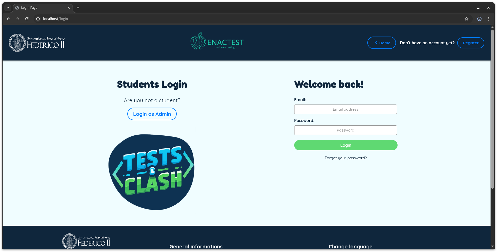
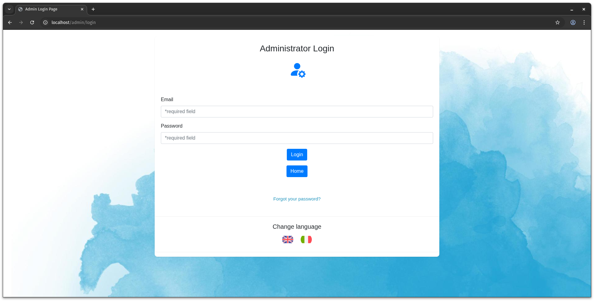
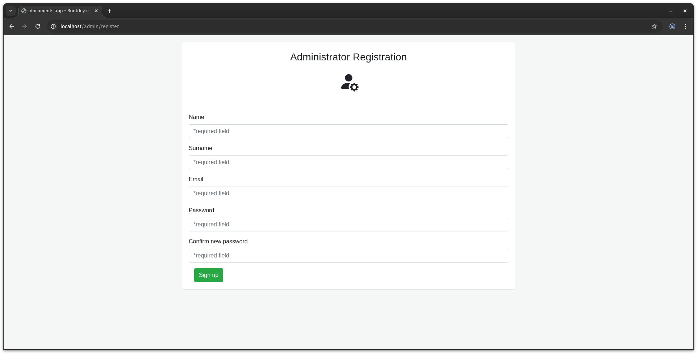
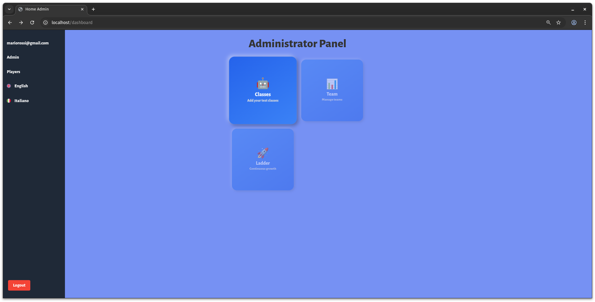
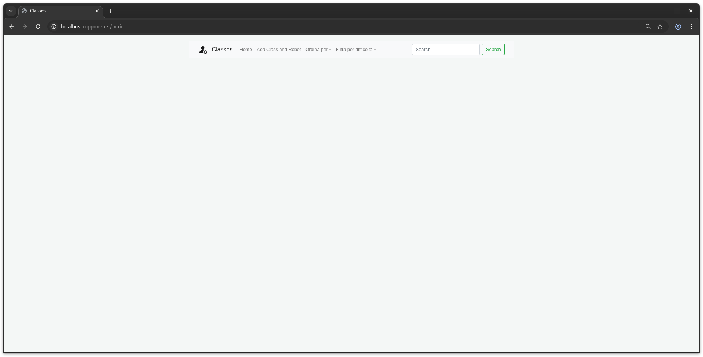
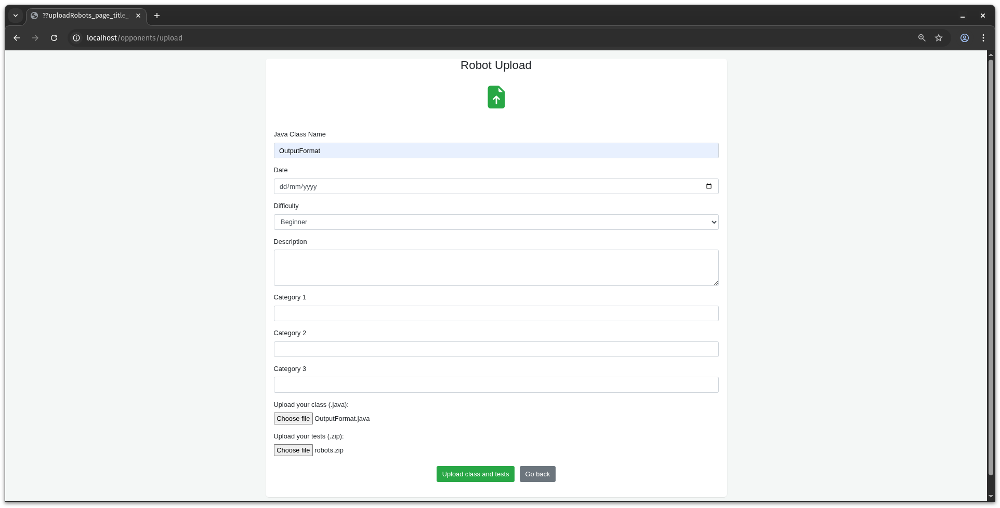
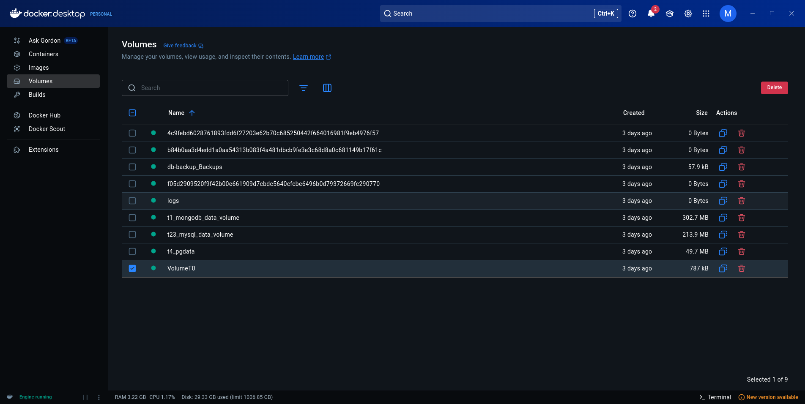

# Professor's Guide

This section describes the features available to instructors, followed by a step-by-step explanation of how to use them.

The current version of the system allows an instructor to:

1. Generate opponents for a given Java class under test;
2. Upload Java classes under test along with their generated opponents to the system;
3. Access the shared Docker volume to review all compilations (and related metrics) performed by players for each game
   played.

## System Installation and Startup

The tool can be deployed either directly on the host machine or using Docker containers. Direct deployment is
recommended for development purposes, while Docker deployment is recommended for all other scenarios. Therefore, we will
focus on Docker deployment.

**TestingRobotChallenge** provides two sets of scripts for both Linux and Windows systems:

- `build.bat` / `build.sh` to build and create Docker images for all microservices and components;
- `deploy.bat` / `deploy.sh` to deploy all containers, create the required Docker volumes and networks, and start the
  services. Local images will be used if available; otherwise, images will be pulled from DockerHub.

## Opponent Generation

Opponent generation is handled by service **T0** and is completely independent of the rest of the system. Opponents can
be generated by running the script `generate.sh` on Linux (using `bash`) or `generate.bat` on Windows. Each execution
will attempt to generate three opponents with increasing difficulty.

Both scripts accept the following input parameters:

1. `tool`: the generation tool to use (`randoop` or `evosuite`);
2. `class_name`: the name of the target Java class to test;
3. `package_name`: the package name of the target Java class (optional);
4. `class_path`: the absolute path on the host machine to the directory containing the target class;
5. `host_output_dir`: the absolute path on the host machine where the generated tests will be saved. Inside this
   directory:
    - EvoSuite-generated tests will be stored in the `EvoSuiteTest` folder.
    - Randoop-generated tests will be stored in the `RandoopTest` folder.

   These folders are already structured correctly to be included in the opponent upload ZIP file.

#### Example

To generate opponents for the class `FTPFile`, which has no package, on Linux, the command will look like this:

```bash
bash generate.sh evosuite FTPFile /absolute/host/path/source/FTPFile.java /absolute/host/path/destination
```

## Sign Up and Login

To register and log in as an instructor (who acts as the system administrator), follow these steps:

1. On the main application page, click **Login as Admin**.
   
2. On the next page, you can log in as an administrator by entering the email and password you set during registration.
   
3. To register, modify the URL by replacing `/admin/login` with `/admin/register`, which will take you to the
   registration page. This manual URL edit was introduced as a temporary security measure to prevent unrestricted
   administrator registration.
   A more robust and user-friendly registration flow with proper access control is currently under development.
   
4. After filling in the required fields (first name, last name, email, password, and password confirmation), the system
   will redirect you to the administrator login page.

## Classes and Opponents Upload

To upload a class and its related opponents, follow these steps:

1. From the Dashboard page (displayed automatically after a successful login), click the **Classes** button:
   
2. On the main upload page, click **Add Class and Robot** from the top navigation bar:
   
3. Fill in the required form fields (class name, difficulty, the Java class to upload, and the associated opponents as
   zip) and click **Upload class and tests**:
   

The upload process duration may vary depending on whether the opponents include JaCoCo and EvoSuite metric files.
The system also accepts opponents without these metrics, in which case it will calculate them automatically by
communicating with the appropriate services. This will increase the upload time.

### ZIP File Structure Specification

The ZIP file containing the opponents (for the uploaded class) must follow the structure below to be accepted and
correctly processed by the system:

1. The ZIP file must contain a single top-level folder named `robots/`;
2. Each subfolder of `robots/` represents a robot (opponent) to be added to the application, where:
    - The folder name **must start** with the robot's name;
    - The folder name **must end** with the string `Test`.

   During the import process, the `Test` suffix will be removed to obtain the actual robot name.
3. Each robot may contain one or more of the following folders:
    - `01Level`, which represents the easy difficulty level;
    - `02Level`, which represents the medium difficulty level;
    - `03Level`, which represents the hard difficulty level.
      Each of these folders must contain one or more executable JUnit test classes for the class under test;
4. Each `0XLevel/` folder may also include the following files:
    - `statistics.csv`, containing the EvoSuite metric results;
    - `coveragetot.xml`, containing the coverage information generated by JaCoCo.

   If these files are missing, the system will automatically calculate the missing statistics using the `T7` and `T8`
   services and generate the necessary files. In this case, the upload process will take longer.

Robots generated via EvoSuite represent the only special case in this structure, due to compatibility with previous
versions of the system. These must be placed inside the `EvoSuiteTest/` folder, and each `XXLevel/` folder must include:

- `TestReport/`, which contains the output files generated by EvoSuite and JaCoCo;
- `TestSourceCode/evosuite-tests/`: contains the JUnit tests generated.

Below is an example of a ZIP file structure for the test class `OutputFormat`:

```html
robots/
├── LLMTest/
│   ├── 01Level/
│   │   ├── report.json
│   │   ├── OutputFormat_*.java
│   │   ├── coveragetot.xml
│   │   └── statistics.csv
│   ├── 02Level/
│   │   ├── report.json
│   │   ├── OutputFormat_*.java
│   │   ├── coveragetot.xml
│   │   └── statistics.csv
│   └── 03Level/
│       ├── report.json
│       ├── OutputFormatTest.java
│       ├── coveragetot.xml
│       └── statistics.csv
├── EvoSuiteTest/
│   ├── 01Level/
│   │   ├── TestReport/
│   │   │   ├── statistics.csv
│   │   │   └── coveragetot.xml
│   │   └── TestSourceCode/
│   │       └── evosuite-tests/
│   │           ├── OutputFormat_ESTest.java
│   │           └── OutputFormat_ESTest_scaffolding.java
│   ├── 02Level/
│   │   ├── TestReport/
│   │   │   ├── statistics.csv
│   │   │   └── coveragetot.xml
│   │   └── TestSourceCode/
│   │       └── evosuite-tests/
│   │           ├── OutputFormat_ESTest.java
│   │           └── OutputFormat_ESTest_scaffolding.java
│   └── 03Level/
│       ├── TestReport/
│       │   ├── statistics.csv
│       │   └── coveragetot.xml
│       └── TestSourceCode/
│           └── evosuite-tests/
│               ├── OutputFormat_ESTest.java
│               └── OutputFormat_ESTest_scaffolding.java
├── RandoopTest/
│   └── 01Level/
│       ├── RegressionTest*.java
│       ├── coveragetot.xml
│       └── statistics.csv
└── StudentTest/
    └── 03Level/
        ├── TestOutputFormat.java
        ├── coveragetot.xml
        └── statistics.csv
```

## Access student compilations

The current version of the system does not allow administrators to access or view player compilations directly from the
interface.
This can only be done by accessing the Docker volume manually. For example, using **Docker Desktop**, follow these
steps:

1. Click on the **Volumes** option in the sidebar menu. From the list that appears, select the volume named `VolumeT0`.
   
2. From there, you can browse the volume’s contents, view files, and download any files of interest.

### Volume Structure

The T0 volume (named as 'VolumeT0') serves as a shared file system for all services. It has two primary purposes:

1. To store the testable classes and their corresponding opponent robots;
2. To preserve a copy of every compilation submitted by players, including related metrics, for each match played.

An example of the volume structure is shown below.

```html
FolderTree
├── ClassUT
│   ├── OutputFormat
│   │   └── Evosuite
│   │       ├── coverage
│   │       │   └── 01Level
│   │       │       ├── coveragetot.xml
│   │       │       └── statistics.csv
│   │       └── project
│   │           └── 01Level
│   │               └── src
│   │                   ├── main
│   │                   │   └── java
│   │                   │       └── OutputFormatSourceCode
│   │                   │           └── OutputFormat.java
│   │                   └── test
│   │                       └── java
│   │                           └── OutputFormatSourceCode
│   │                               ├── OutputFormat_ESTest.java
│   │                               └── OutputFormat_ESTest_scaffolding.java
│   └── unmodified_src
│       └── OutputFormat
│           └── OutputFormat.java
└── StudentTest
    └── Player1
        └── PartitaSingola
            └── OutputFormat
                ├── 2025-05-12_13-07-40
                │   └── Game1
                │       └── Round1
                │           └── Turn0
                │               ├── coverage
                │               │   ├── coveragetot.xml
                │               │   └── statistics.csv
                │               └── project
                │                   └── src
                │                       ├── java
                │                       │   └── main
                │                       │       └── OutputFormat.java
                │                       └── test
                │                           └── main
                │                               └── TestTestOutputFormat.java
                ├── 2025-05-12_13-08-22
                │   └── Game1
                │       └── Round1
                │           └── Turn1
                │               ├── coverage
                │               │   ├── coveragetot.xml
                │               │   └── statistics.csv
                │               └── project
                │                   └── src
                │                       ├── java
                │                       │   └── main
                │                       │       └── OutputFormat.java
                │                       └── test
                │                           └── main
                │                               └── TestTestOutputFormat.java
                └── 2025-05-12_13-10-07
                    └── Game1
                        └── Round1
                            └── Turn2
                                ├── coverage
                                │   ├── coveragetot.xml
                                │   └── statistics.csv
                                └── project
                                    └── src
                                        ├── java
                                        │   └── main
                                        │       └── OutputFormat.java
                                        └── test
                                            └── main
                                                └── TestTestOutputFormat.java
```

The volume is organized into two main directories under a common root folder, referred to as `FolderTree`:

1. `StudentTest`: this directory contains all the user-submitted compilations along with their corresponding results.
   Each compilation is stored in a path with the following structure:
    ```html
    player_id/game_mode/compilation_timestamp/game_id/round_number/turn_number/
    ```
   Each compilation directory includes:
    - Coverage and mutation metrics generated by JaCoCo and EvoSuite (if compilation was successful);
    - The user-written test, stored as a runnable Java project.

2. `ClassUT`: this directory stores the available robots (JUnit test class). Each robot is placed inside a subdirectory
   named after the class being tested and is organized into two subfolders:
    - `coverage`: contains the coverage and mutation metrics results from JaCoCo and EvoSuite;
    - `project`: contains the robot (JUnit test) structured as an executable Java project.

   Additionally, the `unmodified_src` folder holds a pristine copy of each class added to the system. These versions are
   used during gameplay and may differ from the versions inside the robots’ `project` directory. This is because robot
   test execution may require modifications to the class under test—for instance, placing it in a specific package to
   enable compatibility with the test suite.
